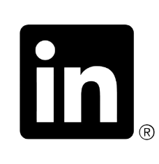

  
  

  
  <h3 style="margin-top: -5px;">
    Founder <a href="https://reframeart.studio" style="text-decoration: none; color: #ffffff;" target="_blank">ReFrame</a>.
    Fueled by coffee, driven by curiosity. CS major and a creative soul exploring history.
  </h3>
  

### Stats

  

### Expertises in

  

### Wanna stay connected

  

### Explore my daily activities on

